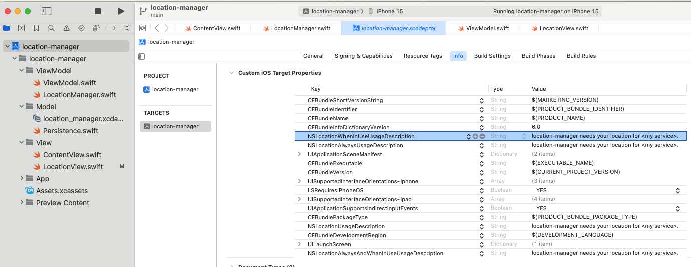

# Location Manager for SwiftUI

SimpleSwiftUI's "location-manager" is a SwiftUI project showcasing a minimalistic implementation of location management within iOS 16.4+ applications. This project covers both manual location searches and automatic location detection with user permission, leveraging SwiftUI, CoreLocation, and MapKit.

## Features

- **Current Location Detection**: Automatically detect the user's current location with their permission.
- **Manual Location Search**: Users can manually search for locations, with search results dynamically updated.
- **SwiftUI Integration**: Fully implemented in SwiftUI, demonstrating modern iOS development practices.
- **CoreLocation and MapKit Usage**: Utilizes CoreLocation for location services and MapKit for searching and displaying location information.

## Requirements

- iOS 16.4+
- Xcode 13.0+
- Swift 5.0+

## Installation

To integrate "location-manager" into your SwiftUI project, follow these steps:

1. Clone the repository or download the source code.
2. Ensure your project targets iOS 16.4 or later.
3. Import the project files into your SwiftUI project.
4. Configure your project's Info.plist to include the necessary permissions for location services (see below).

## Permissions

To access the location features of the user's iPhone, you need permission. In XCode > Click <project name> at the top of the Project Navigator (left panel) > Click <project name> inder Targets > Click "Info" tab > Under "Custom iOS Target Properties", right-click and choose "Raw Keys and Values". Hover mouse on a row item and click the (+) icon to add the 4 rows below:

| Key | Value (will be shown to user)
| --- | ---- |
| `NSLocationWhenInUseUsageDescription` | location-manager needs your location for... |
| `NSLocationWhenInUseUsageDescription` | location-manager needs your location for... |
| `NSLocationAlwaysUsageDescription` | location-manager needs your location for ... |
| `NSLocationUsageDescription` | location-manager needs your location for... |

## License

This project is licensed under the MIT License.
